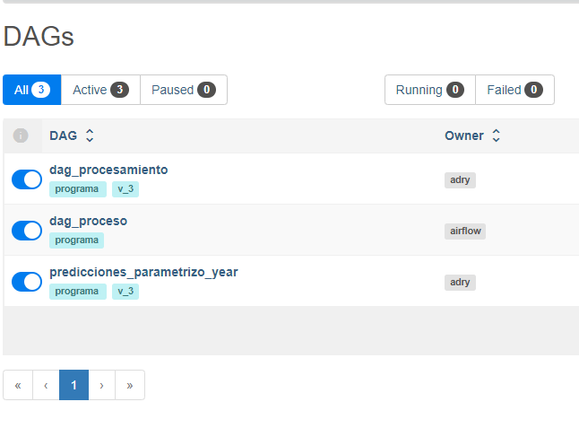
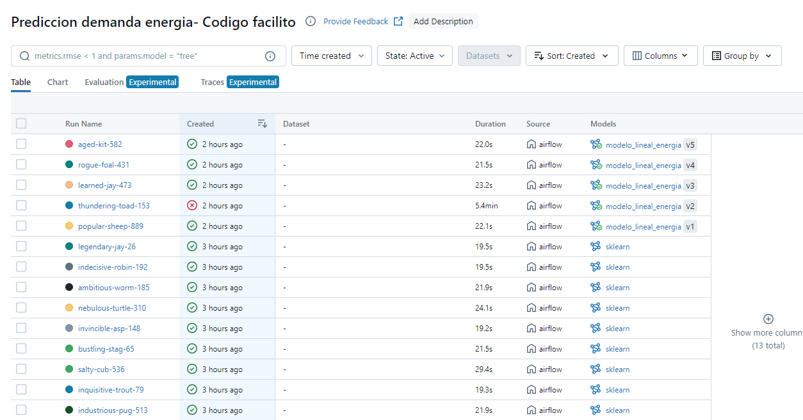
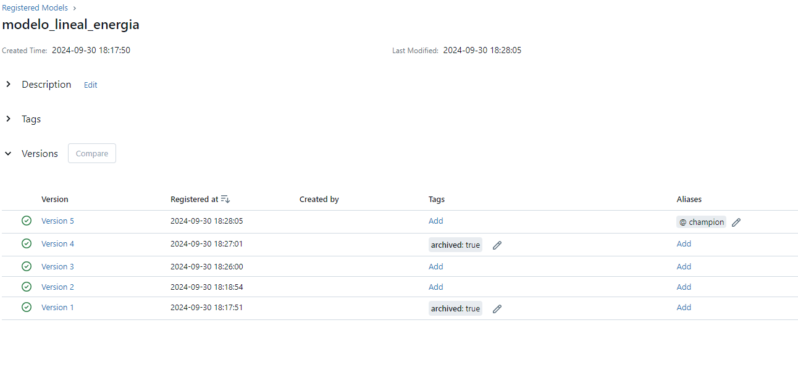
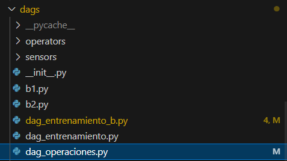
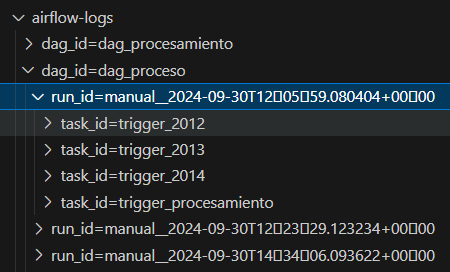

# Prediccion de demanda electrica en la ciudad de Victoria

## Definición del problema y objetivos 
El problema consiste en la predicción de la demanda de energía. El problema queda enmarcado dentro de un problema supervisado de Machine Learning, donde existe la variable target, la demanda, y unas variables con la que intentamos explicar su comportamiento de esta variable objetivo. Como la variable objetivo es numerica, el problema se transforma es un problema de regresion.
 El proceso constara de varias partes:
- transformación y limpieza de datos para que sean aptos para el entrenamiento de ML.
- El entrenamiento del modelo.

Además el dataset es una serie temporal de datos cada media hora de demanda electrica en Victoria, Australia, entre los años 2012 y 2014. El dataset original se puede encontrar [aqui](https://duckduckgo.com).  

Se realizan las siguientes simplificaciones del problema:
- El objetivo solo es predecir la demanda del mes de diciembre de cada año del dataset, a partir de los datos de enero a noviembre. 
- El algoritmo que usa el modelo siempre es una regresión lineal.
- El todas sus versiones el modelo siempre usa las mismas variables.

### La infraestructura 

El programa esta compuesto por contenedores docker orquestados por docker-compose. El archivo de configuración es docker-compsoe.yml. Se ha seguido la norma de un contenedor por servicio.  

Contenedores de Airflow:
- **Airflow init**: inicia y configura airflow
- **webserver**: mantiene la interfaz grafica para Airflow
- **Scheduler**: mantiene el servicio de scheduler. Este servicio decide que tareas se ejecutan y en que orden.
- **db_airflow**: base de datos postgres. Airflow guarda aqui metadata.

Contenedores de MLFLOW:
- **db_mlflow**: base de datos postgres. Mlflow guarda aqui metadata y datos estructurados como metricas.
- **S3**: el servicio se llama MINIO, almecena cubetas, que MLFLOW usa para guardar datos no estructurados, como los modelos de ML.
- **Create_buckets**: es un servicio que crea y configura un bucket para que MLFLOW lo use.
- **Tracking-server**:  servicio de MLFLOW.

La configuración de docker de los contenedores relacionados con Airflow esta basada en https://bytemedirk.medium.com/developing-locally-with-dockerized-apache-airflow-and-postgres-a2890b8ae199

La configuracion de docker de los contenedores relacionados con MLFLOW estan basados en un caso del github de antonio Feregrino https://github.com/fferegrino/cf-ml/tree/main/online-gaming-mlflow-remote


### USO
- Descargar el git
- Abrir terminal, colocarse en esta carpeta. Ejecutar docker-compose
```
'docker-compose up --build'
```
- Esperar a que se carguen todos los servicios:
    - Airflow: http://localhost:8080/  
        user: admin   
        password: admin  
    - MLFLOW: http://localhost:5555/
    - MINIO: http://localhost:9001/  
        user: minio   
        password: minio123  
- Ir al webserver de Airflow (http://localhost:8080/ ). 
Encender los dags de los siguientes procesos:
    - dag_proceso
    - dag_procesamiento
    - predicciones_parametrizo_year
Al finalizar el proceso deberia estar todo así:



- Por último, dar al boton "Trigger dag" en el dag "dag proceso"


## Gestión de Experimentos y Modelos
Se ha utilizado MLFLOW para el registro de modelos y experimentos. Los experimentos estan registros en MLFLOW como se muestra en esta imagen: 



El programa  siempre  entrena en cada predicción un nuevo modelo, y lo compara con el mejor de todas las predicciones anteriores usando la metrica rmse (root mean squared error), y se queda con el modelo que tenga un menor valor de esta metrica. En esta imagen se muestra ejemplo de modelos en los que hay un modelo con alias campeon (el modelo mejor en la última predicción) y los demas modelos registrados.



## Despliegue del modelo y Orquestación
Se ha tomado un depliegue tipo batch. Se ha escogido airflow porque se van a realizar
El entrenamiento de modelos y predicciones en un tiempo acotado, y la pipeline siempre sigue los mismos pasos. Entonces se ha escogido un tipo de despliegue batch usando Airflow como orquestador. Las pipeline estan realizadas con sklearn.

Los dags componen a su vez de tareas. Estos dags estan en archivos con python dentro de la carpeta dag, como se ve en la imagen: 



La interfaz de airflow  sube actualiza automaticamente los dags.Ademas se lanzan los procesos


El dag llamado "dag_proceso" es especial porque es un dag que inicia a su vez los otros dos dag.
- **dag_procesamiento**: transformación de datos. El output de esta archivo son los archivos procesamiento + año (que puede variar entre 2012 y 2014)
- **predicciones_parametrizo_year**: este dag es el encargado de entrenar y registrar modelos, comparar modelos entre sí y subir la metrica de error a MLFLOW. Este dag se lanza tres veces, una para cada año, usando como argumento de entrada el año.

## Monitoreo de Modelos
Airflow usa de forma nativa el paquete de logeo logging. No se usa ninguna herramienta adicional. 
Airflow guarda los logs dentro de la carpeta 'airflow-logs'. Dentro de esta estan ordenadas por dag_id, ejecución y tareas dentro de cada ejecución. En esta imagen muestra el logs de experimentos:




## Siguienes pasos
- Un posible siguiente paso sería mandar las predicciones a una base de datos. 
- Unir las dos servicios postgres en uno solo para consumir menos recursos. Técnicamente se podria haber hecho dos base de datos separadas y hubiera funcionado. 
- Usar algún tipo de CI/CD